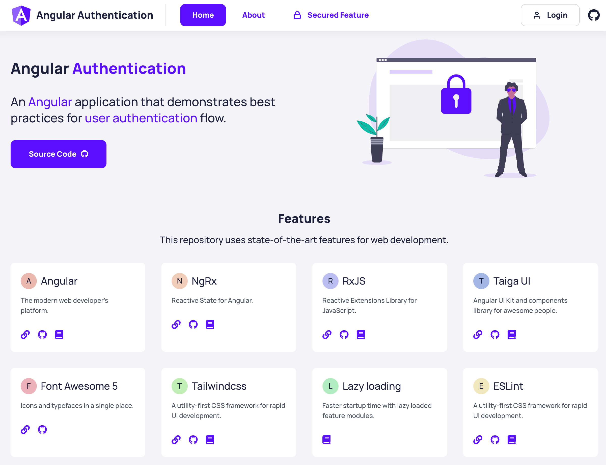

# Angular Authentication

An Angular application that demonstrates best practices for user authentication.

[](https://open.vscode.dev/nikosanif/angular-authentication)

## Table of Contents

- [Live Demo](#live-demo)
- [Getting Started](#getting-started)
- [Features](#features)
- [Tech Stack](#tech-stack)
- [High-level Design](#high-level-design)
- [Contributing](#contributing)
- [Support](#support)
- [License](#license)

## Live Demo

Live application: [angular-authentication.netlify.app](https://angular-authentication.netlify.app/)



## Getting Started

### Prerequisites

- [Node.js](https://nodejs.org/en/)
- [Angular CLI](https://angular.io/cli)

### Setup & Usage

- Clone the current repository to your machine
- Run `npm install` to install all the dependencies
- Run `ng serve` to start build and serve the Angular app
- Open your browser at `http://localhost:4200`

### Useful Commands

## Features

## Tech Stack

## High-level Design

Below is the simplified version of the application structure.

```sh
./src
├── app
│   ├── app
│   │   ├── app.component.html
│   │   ├── app.component.scss
│   │   └── app.component.ts
│   │
│   ├── app-routing.module.ts
│   ├── app.module.ts
│   │
│   ├── auth
│   │   ├── auth.module.ts
│   │   ├── auth.service.ts
│   │   ├── guards
│   │   ├── interceptors
│   │   ├── login
│   │   └── store
│   │
│   ├── core
│   │   ├── core.module.ts
│   │   ├── fake-api
│   │   └── services
│   │
│   ├── features
│   │   ├── about
│   │   ├── home
│   │   └── secured-feat
│   │
│   └── shared
│       ├── ui
│       └── util
├── assets
│   ├── ...
│
├── environments
│   ├── environment.prod.ts
│   └── environment.ts
│
├── ...
│
└── theme
    ├── _components.scss
    ├── _typography.scss
    └── index.scss
```

## Contributing

## Support

## License
